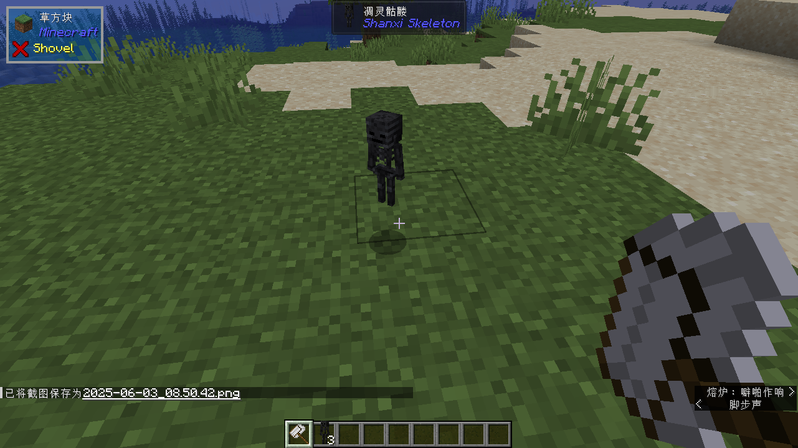

# ShanxiSkeleton

A Minecraft mod that introduces skeleton machines that produces coals and
additional items.

# Gameplay

To begin, craft a wither skeleton catcher. Right-click wither skeletons with
this on your hand to turn wither skeletons into items.

Then craft a wither skeleton producer and put the wither skeletons you have
caught into it. The wither skeletons will begin to produce coals. The more
wither skeletons you put into the producer, the faster the process will go.
You can also put some small flowers into the producer to get wither roses
as byproduct.

If you are worn out on catching wither skeletons, you can craft a wither
skeleton breeder. Put wither skeletons as well as wither roses into the
breeder to produce more wither skeletons.

To get rid of redundant wither skeleton items, you can craft a wither
skeleton slaughterer. Put wither skeletons into the slaughterer to kill
them and get their drops. You can also get wither skeleton skulls from
this slaughterer with the chance rate of 25%, which is pretty higher than
vanilla.

# License

This mod is available under [the BSD 3-Clause License](LICENSE.txt).
